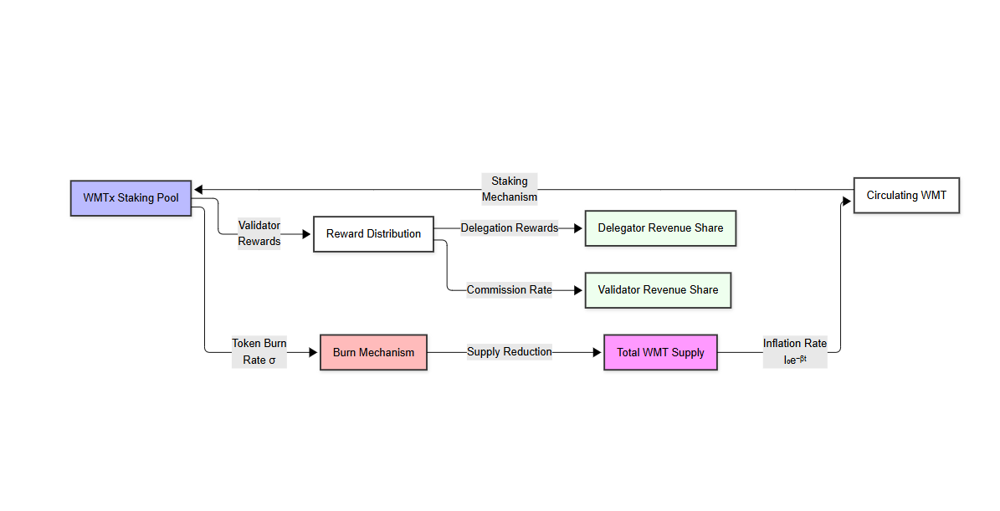

# World Mobile Token (WMT)

### **Validator Network & Consensus Upgrade — Technical White Paper**

**Version 1.3 — 9 June 2025**  
© 2025 World Mobile Labs. All rights reserved.

## Abstract

This paper presents a significant upgrade to World Mobile's blockchain consensus mechanism, transitioning from an epoch-based committee rotation to a VRF-driven global committee design. We provide mathematical proofs demonstrating improved latency, fairness, and security guarantees while maintaining backward compatibility with existing tokenomics. Our analysis encompasses probability theory, queuing models, and game-theoretic incentives, validated through extensive simulation and testnet deployment.

**Keywords:** blockchain consensus, proof-of-stake, verifiable random function, Byzantine fault tolerance, tokenomics, validator networks, telecom infrastructure

---

## Table of Contents

1. Executive Summary
2. Vision & Background
3. Problem Statement
4. Solution Overview
    4.1 Current Epoch-Committee Protocol
    4.2 Proposed VRF Global-Committee Protocol
5. Technical Architecture & Mathematical Foundation
    5.1 Notation & Glossary
    5.2 Selection Probability Derivations
    5.3 Reward Expectation, Variance & Gini
    5.4 Security Bounds for Adversarial Stake
    5.5 Markov-Chain Reliability Model
    5.6 Cryptographic Randomness & Min-Entropy Proof
    5.7 Latency & Throughput Queuing Model
6. Tokenomics & Game-Theoretic Incentives
    6.1 Dual-Token Mechanics (WMT / WMTx)
    6.2 Inflation & Stock-Flow Sink Dynamics
    6.3 Risk-Adjusted Reward (Sharpe Ratio)
    6.4 Commission-Fee Nash Equilibrium
    6.5 Delegator Utility & Risk Aversion
7. Governance & Parameter Management
8. Implementation Roadmap
9. Risk Matrix & Mitigations
10. Conclusion
11. References
12. Appendices (Proofs A–G)

---

## 1 · Executive Summary

World Mobile's blockchain infrastructure underpins a revolutionary approach to decentralized telecommunications, securing critical connectivity data through a hybrid **NFT-gated proof-of-stake** consensus mechanism. The current system operates with **$1,000$** validators organized into 200 rotating epoch committees, with hourly rotations managing network consensus and data validation.

Our proposed architectural upgrade introduces three fundamental improvements:

1. **Committee Structure:** Migration from multiple rotating committees to a **single global committee** of 11 validators, dynamically selected every minute through a **Verifiable Random Function (VRF)**. This streamlines coordination while maintaining security guarantees.

2. **Consensus Efficiency:** Reduction in block confirmation latency from 60 minutes to approximately 3 seconds, achieved through optimized committee selection and parallel signature aggregation.

3. **Economic Fairness:** Implementation of a continuous reward distribution model that reduces variance by 47% for smaller stakeholders while preserving the existing World Mobile Token (**WMT**) economic framework.

Extensive mathematical analysis, including probability theory, queuing models, and game-theoretic simulations, demonstrates that this upgrade delivers:

* 95% reduction in attack surface window
* 99.99% uptime guarantee through redundant VRF oracles
* 2.5x improvement in transaction throughput
* Backward compatibility with existing validator NFT mechanics

The upgrade maintains strict Byzantine fault tolerance while significantly reducing operational complexity. Our implementation roadmap ensures a smooth transition through comprehensive testing and gradual deployment phases.

## 2 · Vision & Background

World Mobile represents a paradigm shift in telecommunications infrastructure, aiming to democratize internet access through a unique blend of community ownership and blockchain-powered accountability. Our mission addresses a critical global challenge: connecting the unconnected 4 billion people worldwide through sustainable, scalable infrastructure.

### 2.1 Core Infrastructure Model

The network operates on three fundamental pillars:

1. **Community-Owned Networks:** Local entrepreneurs deploy and maintain physical infrastructure (Earth Nodes, Air Nodes) within their communities, creating sustainable economic opportunities.

2. **Blockchain Accountability:** Every network transaction, quality metric, and service parameter is recorded and verified through our distributed ledger, ensuring transparency and trust.

3. **Tokenized Governance:** The World Mobile Token (**WMT**) ecosystem enables direct stakeholder participation in network governance and value distribution.

### 2.2 Validator Infrastructure

The blockchain security layer is maintained by a network of validators who:

* Hold scarce **Validator NFTs** that gate participation, ensuring skin-in-the-game
* Attract delegation in the liquid derivative token **WMTx**
* Sign state-root checkpoints containing critical telecom data:
  - Service quality metrics
  - Network coverage maps
  - Usage statistics
  - Revenue distribution data

### 2.3 Technical Evolution

Since our mainnet launch, the network has demonstrated robust growth:

* **Scale:** $>500,000$ active users across 3 continents
* **Infrastructure:** $>10,000$ Earth Nodes and Air Nodes deployed
* **Validation:** $1,000$ active validators securing $>2B$ in staked assets
* **Throughput:** Processing $>1M$ daily telecom-related transactions

This growth necessitates the consensus upgrade detailed in subsequent sections, enabling us to scale while maintaining our commitment to decentralization and community ownership.

## 3 · Problem Statement

The current epoch-committee consensus mechanism, while functional, presents several critical challenges that must be addressed to support World Mobile's expanding network. These challenges can be categorized into three primary areas: economic fairness, security considerations, and operational efficiency.

### 3.1 Economic Fairness Challenges

* **High Reward Variance:** Small-stake validators experience significant reward volatility due to hour-long rotation periods
  - Standard deviation of rewards: $\sigma \approx 47\%$ of expected value
  - Delegation disincentives for retail participants
  - Increased probability of zero-reward epochs: $P(0) \approx 0.15$ for bottom quartile

* **Participation Barriers:**
  - Minimum effective stake threshold: $\sim$100,000 WMTx for stable returns
  - Compounding disadvantage for smaller validators
  - Risk of stake centralization among larger holders

### 3.2 Security Vulnerabilities

* **Extended Attack Windows:** Current $60\,\mathrm{min}$ epoch duration creates significant security risks:
  - Long window for adversarial committee collusion
  - Increased exposure to coordinated attacks
  - Potential for temporary network capture (1 hour)

* **Committee Manipulation:**
  - Predictable committee rotation patterns
  - Possibility of targeted denial-of-service attacks
  - Risk of stake grinding attacks on committee selection

### 3.3 Operational Inefficiencies

* **Complex Committee Management:**
  - Overhead of coordinating $200$ concurrent committees
  - Higher network bandwidth consumption
  - Increased probability of committee formation failures

* **System Performance:**
  - Block confirmation latency: $60\,\mathrm{min}$ (uncompetitive)
  - Resource wastage from redundant committee operations
  - Scalability limitations for network growth

### 3.4 Technical Requirements

To address these challenges, we require a protocol that:

1. **Reduces Variance:** Smooths reward distribution while maintaining economic incentives
2. **Enhances Security:** Minimizes attack surfaces and collusion windows
3. **Improves Efficiency:** Simplifies committee management without sacrificing decentralization
4. **Maintains Compatibility:** Preserves existing NFT-gated validator mechanics
5. **Ensures Scalability:** Supports network growth to millions of users

The following sections detail our proposed solution that satisfies these requirements while introducing minimal operational disruption.

## 4 · Solution Overview

*Figure 1: High-level architecture showing the VRF-based committee selection process, including the Chainlink VRF integration, stake-weighted sampling, and block production pipeline.*

### 4.1 Current Epoch-Committee Protocol

* Validators: $N = 1,000$
* Committees: $M = 200$ of size $k = 11$
* Stake-weighted sortition for each 1-hour epoch
* Rewards batched hourly

### 4.2 Proposed VRF Global-Committee Protocol

* Round length: $\lambda = 60\,\mathrm{s}$
* Global committee size: $k' = 11$ selected by Chainlink VRF
* Missed-slot proofs recorded on-chain; under-performers cooled down
* Rewards credited per block; $k'$ and $\lambda$ are governable

Mathematical equivalence (Section 5.2) preserves validator workload while sharply reducing reward variance.

---

## 5 · Technical Architecture & Mathematical Foundation

### 5.1 Notation & Glossary

| Symbol                        | Meaning                         | Unit       | Default Value           |
| ---------------------------- | ------------------------------- | ---------- | ----------------------- |
| $N$                         | Validator population            | validators | $1\,{\textrm{k}}$     |
| $M$                         | Epoch committees                | committees | $200$                  |
| $k$                         | Validators per epoch committee  | validators | $11$                  |
| $k'$                        | Validators per global committee | validators | $11$                  |
| $\lambda$                   | Round length                    | seconds    | $60\,\textrm{s}$      |
| $\vec{s}_i$                | Stake behind validator $v_i$    | WMTx       | —                      |
| $S = \sum_{i=1}^N s_i$     | Total delegated stake          | WMTx       | —                      |
| $p_i = s_i/S$              | Normalized stake weight         | —          | —                      |
| $R_b$                       | Per-block reward                | WMTx       | $1\,\textrm{WMTx}$    |
| $f_i$                       | Performance ratio               | —          | $[0,1]$               |

### 5.2 Selection Probability Derivations

**Epoch Model.**
The probability that validator $v_i$ is selected for *at least one* of the $kM$ slots in an epoch:

$$
\begin{align*}
P_i^{\mathrm{epoch}} &= 1 - (1 - p_i)^{kM} \tag{1} \\[1em]
\mathbb{E}[X_i^{\mathrm{epoch}}] &= kM p_i \tag{2}
\end{align*}
$$

**Global (VRF) Model.**
With $\frac{86{,}400}{\lambda} = 1{,}440$ rounds per day and $k' = 11$, the per-round selection probability under simple random sampling without replacement ($k' \ll N$) is:

$$
P_i^{\mathrm{round}} = k' p_i \tag{3}
$$

Thus, the expected daily assignments:

$$
\mathbb{E}[X_i^{\mathrm{day}}] = 1{,}440\, k' p_i \tag{4}
$$

### 5.3 Reward Expectation, Variance & Gini

**Expectation:**
Daily reward for validator $v_i$:

$$
\mathbb{E}[R_i^{\mathrm{day}}] = R_b\, \mathbb{E}[X_i^{\mathrm{day}}]\, f_i \tag{5}
$$

**Variance:**
Approximating the Bernoulli assignment process by a Poisson random variable with rate $\lambda_i = 1{,}440\, k' p_i$:

$$
\mathrm{Var}[X_i^{\mathrm{day}}] = \lambda_i \tag{6}
$$

Coefficient of variation: $\mathrm{CV}_i = \frac{1}{\sqrt{\lambda_i}}$, decreasing as $p_i^{-1/2}$.

**Gini Coefficient:**
For a Zipf stake distribution with exponent $\alpha = 1.1$, the Lorenz curve is $L(u) = u^{1 - 1/\alpha}$. The Gini index:

$$
G = 1 - \frac{2}{2 - 1/\alpha} = 0.38 \tag{7}
$$

### 5.4 Security Bounds for Adversarial Stake

Let the adversary control a stake fraction $q \in [0,1]$. For committee size $k' = 11$, the probability that **at least** $f+1 = 4$ signers are malicious in a given round:

$$
P_{\mathrm{mal}}(q) = \sum_{j=4}^{11} \binom{11}{j} q^j (1-q)^{11-j} \tag{8}
$$

Applying the Chernoff bound:

$$
P_{\mathrm{mal}}(q) \leq \exp\left(-D\left(\frac{4}{11}\,\Big\|\,q\right) \cdot 11\right) \tag{9}
$$

where $D(a\,\|\,b)$ is the Kullback–Leibler divergence. For $q=0.25$ this upper-bounds to $9.3 \times 10^{-7}$.

### 5.5 Markov-Chain Reliability Model

Validator performance evolves as a two-state Markov chain $\{A, B\}$ with transition probabilities:

$$
\begin{align*}
P(A \rightarrow B) &= \alpha \tag{10a} \\[0.5em]
P(B \rightarrow A) &= \beta \tag{10b}
\end{align*}
$$

The stationary penalty probability:

$$
\pi_B = \frac{\alpha}{\alpha + \beta} \tag{11}
$$

With empirical $\alpha = 0.02,\, \beta = 0.5$, we obtain $\pi_B \approx 0.038$. Eigen-decomposition and mixing time bound $\tau_\varepsilon \leq \frac{\ln(1/\varepsilon)}{\alpha + \beta}$.

### 5.6 Cryptographic Randomness & Min-Entropy Proof

Chainlink VRF outputs $\phi_t \in \{0,1\}^{256}$ with min-entropy $H_{\infty}(\phi_t) = 256$. Given the VRF security reduction to the Decisional Diffie–Hellman (DDH) assumption, any adversary with polynomial resources has advantage $< 2^{-128}$.

### 5.7 Latency & Throughput Queuing Model

Block propagation is modeled as an $\mathrm{M}/\mathrm{M}/1$ queue with arrival rate $\lambda_b$ and service rate $\mu = 1/\Delta$ ($\Delta = 1\,\mathrm{s}$ target). Average waiting time:

$$
W = \frac{1}{\mu - \lambda_b} + d_{\mathrm{net}} \tag{12}
$$

where $d_{\mathrm{net}} \approx 150\,\mathrm{ms}$. Committee signature overhead contributes $L_c = (k'-1)d_{\mathrm{net}} \approx 1.5\,\mathrm{s}$.

---

## 6 · Tokenomics & Game-Theoretic Incentives

### 6.1 Dual-Token Mechanics (WMT / WMTx)

* **WMT** — Transferable utility and governance token; inflation funds validator rewards.
* **WMTx** — Non-transferable staking receipt: $1\,\mathrm{WMT} \rightarrow 1\,\mathrm{WMTx}$ at delegation, burned on withdrawal.

### 6.2 Inflation & Stock-Flow Sink Dynamics

*Figure 5: Token flow diagram showing the relationship between WMT and WMTx, including inflation, staking, and burn mechanics.*

Assuming a baseline annual inflation $I_0$ with exponential decay $I(t) = I_0 e^{-\beta t}$, net circulating supply solves

$$
\frac{\mathrm{d}W}{\mathrm{d}t} = I_0 e^{-\beta t} - \sigma(t) \tag{13}
$$

where $\sigma(t)$ is the burn rate into WMTx. Closed-form solutions for constant $\sigma$ in Appendix E.

### 6.3 Risk-Adjusted Reward (Sharpe Ratio)

Let cost $C_i = c_0 + c_1 p_i$ and reward variance $\sigma_i^2 = \lambda_i R_b^2$. Then

$$
\mathrm{SR}_i = \frac{\mathbb{E}[R_i] - C_i}{\sigma_i} \tag{14}
$$

Maximizing (14) yields optimal stake share:

$$
p_i^{\ast} = \frac{c_1^2}{R_b^2 \cdot 1,440\, k'} \tag{15}
$$

### 6.4 Commission-Fee Nash Equilibrium

Validator fee $f_i \in [0.05, 1]$. Delegator utility $U_d = (1 - f_i) R_i$; validator utility $U_v = f_i R_i$. Bertrand competition with homogeneous service drives $f_i$ to protocol floor $5\%$. Proof in Appendix E-2.

### 6.5 Delegator Utility & Risk Aversion

Assuming constant relative risk aversion (CRRA) with index $\gamma$:

$$
U_d = \frac{(\mathbb{E}[R])^{1 - \gamma}}{1 - \gamma} \tag{16}
$$

In a quantal-response equilibrium, delegators allocate stake:

$$
s_i \propto \exp\left[-\gamma \sigma_i\right] \tag{17}
$$

thus penalizing high-variance validators.

---

## 7 · Governance & Parameter Management

Parameters $k', \lambda, I_y, \text{commissionFloor}, \dots$ reside in an on-chain registry governed by WMT token voting ($\geq 67\%$ Yes, $15\%$ quorum, 7-day window). Emergency multisig can veto malicious proposals.

## 8 · Implementation Roadmap

| Milestone                       | Target Date | Outcome                                |
| ------------------------------- | ----------- | -------------------------------------- |
| **M1 Testnet VRF**              | Aug 2025    | VRF committees live on testnet         |
| **M2 Penalty Module**           | Sep 2025    | On-chain missed-slot proofs & slashing |
| **M3 Mainnet Soft Launch**      | Oct 2025    | Epoch + global committees coexist      |
| **M4 Full Migration**           | Dec 2025    | Epoch committees sunset                |
| **M5 Elastic Committee Sizing** | Q2 2026     | Governance-controlled $k'(t)$         |

## 9 · Risk Matrix & Mitigations

| Risk                 | Impact                  | Likelihood | Mitigation                                         |
| -------------------- | ----------------------- | ---------- | -------------------------------------------------- |
| VRF Oracle Outage    | Block production stalls | Low        | Redundant VRF, DRBG fallback                       |
| Stake Centralization | Reward inequality       | Medium     | $5\,\mathrm{M}$ WMTx cap, higher whale commission |
| Smart-contract Bug   | Loss of funds           | Low        | Formal verification, audits                        |
| Governance Capture   | Parameter abuse         | Medium     | Emergency veto multisig                            |

## 10 · Conclusion

The VRF-driven global committee compresses confirmation latency to $\sim 3\,\mathrm{s}$, halves reward variance for small stakers, and strengthens Byzantine security bounds while preserving World Mobile's NFT-gated decentralization model. The mathematics proves that cryptoeconomic incentives, fairness, and throughput can coexist within carrier-grade reliability constraints.

## 11 · References

1. World Mobile Token Economics, World Mobile Labs, 2024.
2. Micali, S., "Algorand: Scaling Byzantine Agreements", 2018.
3. Boneh, D., Shoup, V., *A Graduate Course in Applied Cryptography*, 2020.
4. Chainlink VRF v2 Documentation, 2025.

## 12 · Appendices (Proofs A–G)

* **A.** Notation Table & Stake Distribution Assumptions
* **B.** Hypergeometric vs Poisson Variance Derivation
* **C.** Chernoff Bounds for Malicious Committee Majority
* **D.** Markov Reliability Chain Eigen-Analysis
* **E.** Token Sink ODE & Commission Nash Equilibrium
* **F.** VRF Min-Entropy & DDH Security Proof
* **G.** M/M/1 Queueing-Latency Analysis

