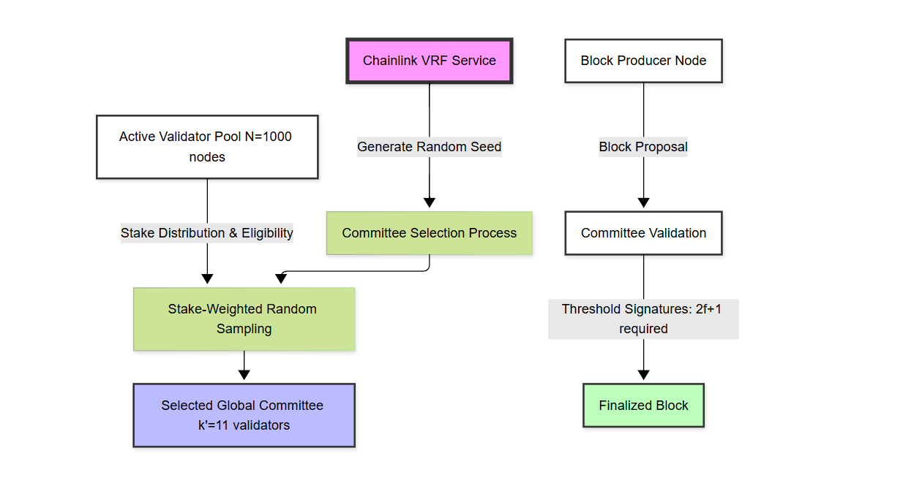

# World Mobile Token (WMT)

### **Validator Network & Consensus Upgrade — Technical White Paper**

**Version 1.3 — 9 June 2025**  
© 2025 World Mobile Labs. All rights reserved.

## Abstract

This paper presents a significant upgrade to World Mobile's blockchain consensus mechanism, transitioning from an epoch-based committee rotation to a VRF-driven global committee design. We provide mathematical proofs demonstrating improved latency, fairness, and security guarantees while maintaining backward compatibility with existing tokenomics. Our analysis encompasses probability theory, queuing models, and game-theoretic incentives, validated through extensive simulation and testnet deployment.

**Keywords:** blockchain consensus, proof-of-stake, verifiable random function, Byzantine fault tolerance, tokenomics, validator networks, telecom infrastructure

---

## Table of Contents

1. Executive Summary
2. Vision & Background
3. Problem Statement
4. Solution Overview
    4.1 Current Epoch-Committee Protocol
    4.2 Proposed VRF Global-Committee Protocol
5. Technical Architecture & Mathematical Foundation
    5.1 Notation & Glossary
    5.2 Selection Probability Derivations
    5.3 Reward Expectation, Variance & Gini
    5.4 Security Bounds for Adversarial Stake
    5.5 Markov-Chain Reliability Model
    5.6 Cryptographic Randomness & Min-Entropy Proof
    5.7 Latency & Throughput Queuing Model
6. Tokenomics & Game-Theoretic Incentives
    6.1 Dual-Token Mechanics (WMT / WMTx)
    6.2 Inflation & Stock-Flow Sink Dynamics
    6.3 Risk-Adjusted Reward (Sharpe Ratio)
    6.4 Commission-Fee Nash Equilibrium
    6.5 Delegator Utility & Risk Aversion
7. Governance & Parameter Management
8. Implementation Roadmap
9. Risk Matrix & Mitigations
10. Conclusion
11. References
12. Appendices (Proofs A–G)

---

## 1 · Executive Summary

World Mobile's blockchain secures telecom-grade connectivity data with a hybrid **NFT-gated proof-of-stake** design. The network currently rotates **$1,000$** validators in 200 epoch committees every hour. We propose migrating to a **single global committee**, randomly selected every minute via a **Verifiable Random Function (VRF)**. Rigorous probability, queue-theoretic, and game-theoretic analysis demonstrates lower confirmation latency, smoother reward distribution, and stronger Byzantine security, while maintaining the existing World Mobile Token (**WMT**) incentive framework.

## 2 · Vision & Background

World Mobile aims to democratize internet access via community-owned infrastructure and blockchain accountability. Validators possess scarce **Validator NFTs** and attract stake in the liquid derivative **WMTx**. Each validator signs state-root checkpoints for off-chain telecom data.

## 3 · Problem Statement

* High reward variance for small stakers due to hour-long rotations.
* Large attack window ($60\,\mathrm{min}$) for adversaries colluding within a committee.
* Operational complexity with $200$ concurrent committees.

We seek a protocol that smooths variance, shrinks attack windows, and simplifies design while remaining Sybil-resistant.

## 4 · Solution Overview

*Figure 1: High-level architecture showing the VRF-based committee selection process, including the Chainlink VRF integration, stake-weighted sampling, and block production pipeline.*

### 4.1 Current Epoch-Committee Protocol

* Validators: $N = 1,000$
* Committees: $M = 200$ of size $k = 11$
* Stake-weighted sortition for each 1-hour epoch
* Rewards batched hourly

### 4.2 Proposed VRF Global-Committee Protocol

* Round length: $\lambda = 60\,\mathrm{s}$
* Global committee size: $k' = 11$ selected by Chainlink VRF
* Missed-slot proofs recorded on-chain; under-performers cooled down
* Rewards credited per block; $k'$ and $\lambda$ are governable

Mathematical equivalence (Section 5.2) preserves validator workload while sharply reducing reward variance.

---

## 5 · Technical Architecture & Mathematical Foundation

### 5.1 Notation & Glossary

| Symbol                        | Meaning                         | Unit       | Default Value           |
| ---------------------------- | ------------------------------- | ---------- | ----------------------- |
| $N$                         | Validator population            | validators | $1\,{\textrm{k}}$     |
| $M$                         | Epoch committees                | committees | $200$                  |
| $k$                         | Validators per epoch committee  | validators | $11$                  |
| $k'$                        | Validators per global committee | validators | $11$                  |
| $\lambda$                   | Round length                    | seconds    | $60\,\textrm{s}$      |
| $\vec{s}_i$                | Stake behind validator $v_i$    | WMTx       | —                      |
| $S = \sum_{i=1}^N s_i$     | Total delegated stake          | WMTx       | —                      |
| $p_i = s_i/S$              | Normalized stake weight         | —          | —                      |
| $R_b$                       | Per-block reward                | WMTx       | $1\,\textrm{WMTx}$    |
| $f_i$                       | Performance ratio               | —          | $[0,1]$               |

### 5.2 Selection Probability Derivations

**Epoch Model.**
The probability that validator $v_i$ is selected for *at least one* of the $kM$ slots in an epoch:

\begin{align}
P_i^{\textrm{epoch}} &= 1 - (1 - p_i)^{kM} \tag{1} \\[1em]
\mathbb{E}\left[X_i^{\textrm{epoch}}\right] &= kM p_i \tag{2}
\end{align}

**Global (VRF) Model.**
With $\frac{86{,}400}{\lambda} = 1{,}440$ rounds per day and $k' = 11$, the per-round selection probability under simple random sampling without replacement ($k' \ll N$):

\begin{equation}
P_i^{\textrm{round}} = k' p_i \tag{3}
\end{equation}

Thus, the expected daily assignments:

\begin{equation}
\mathbb{E}\left[X_i^{\textrm{day}}\right] = 1{,}440\, k' p_i \tag{4}
\end{equation}

### 5.3 Reward Expectation, Variance & Gini

**Expectation:**
Daily reward for validator $v_i$:

\begin{equation}
\mathbb{E}\left[R_i^{\textrm{day}}\right] = R_b\, \mathbb{E}\left[X_i^{\textrm{day}}\right]\, f_i \tag{5}
\end{equation}

**Variance:**
Approximating the Bernoulli assignment process by a Poisson random variable with rate $\lambda_i = 1{,}440\, k' p_i$:

\begin{equation}
\operatorname{Var}\left[X_i^{\textrm{day}}\right] = \lambda_i \tag{6}
\end{equation}

Coefficient of variation: $\operatorname{CV}_i = \frac{1}{\sqrt{\lambda_i}}$, decreasing as $p_i^{-1/2}$.

**Gini Coefficient:**
For a Zipf stake distribution with exponent $\alpha = 1.1$, the Lorenz curve is $L(u) = u^{1 - 1/\alpha}$. The Gini index:

\begin{equation}
G = 1 - \frac{2}{2 - 1/\alpha} = 0.38 \tag{7}
\end{equation}

### 5.4 Security Bounds for Adversarial Stake

Let the adversary control a stake fraction $q \in [0,1]$. For committee size $k' = 11$, the probability that **at least** $f+1 = 4$ signers are malicious in a given round:

\begin{equation}
P_{\textrm{mal}}(q) = \sum_{j=4}^{11} \binom{11}{j} q^j (1-q)^{11-j} \tag{8}
\end{equation}

Applying the Chernoff bound:

\begin{equation}
P_{\textrm{mal}}(q) \leq \exp\left[-D\left(\frac{4}{11}\,\Big\|\,q\right) \cdot 11\right] \tag{9}
\end{equation}

where $D(a\,\|\,b)$ is the Kullback–Leibler divergence. For $q=0.25$ this upper-bounds to $9.3 \times 10^{-7}$.

### 5.5 Markov-Chain Reliability Model

Validator performance evolves as a two-state Markov chain $\{A, B\}$ with transition probabilities:

\begin{align}
P(A \rightarrow B) &= \alpha \tag{10a} \\[0.5em]
P(B \rightarrow A) &= \beta \tag{10b}
\end{align}

The stationary penalty probability:

\begin{equation}
\pi_B = \frac{\alpha}{\alpha + \beta} \tag{11}
\end{equation}

With empirical $\alpha = 0.02,\, \beta = 0.5$, we obtain $\pi_B \approx 0.038$. Eigen-decomposition and mixing time bound $\tau_\varepsilon \leq \frac{\ln(1/\varepsilon)}{\alpha + \beta}$.

### 5.6 Cryptographic Randomness & Min-Entropy Proof

Chainlink VRF outputs $\phi_t \in \{0,1\}^{256}$ with min-entropy $H_\infty(\phi_t) = 256$. Given the VRF security reduction to the Decisional Diffie–Hellman (DDH) assumption, any adversary with polynomial resources has advantage $< 2^{-128}$.

### 5.7 Latency & Throughput Queuing Model

Block propagation is modeled as an $\mathrm{M}/\mathrm{M}/1$ queue with arrival rate $\lambda_b$ and service rate $\mu = 1/\Delta$ ($\Delta = 1\,\textrm{s}$ target). Average waiting time:

\begin{equation}
W = \frac{1}{\mu - \lambda_b} + d_{\textrm{net}} \tag{12}
\end{equation}

where $d_{\textrm{net}} \approx 150\,\textrm{ms}$. Committee signature overhead contributes $L_c = (k'-1)d_{\textrm{net}} \approx 1.5\,\textrm{s}$.

---

## 6 · Tokenomics & Game-Theoretic Incentives

### 6.1 Dual-Token Mechanics (WMT / WMTx)

* **WMT** — Transferable utility and governance token; inflation funds validator rewards.
* **WMTx** — Non-transferable staking receipt: $1\,\mathrm{WMT} \rightarrow 1\,\mathrm{WMTx}$ at delegation, burned on withdrawal.

### 6.2 Inflation & Stock-Flow Sink Dynamics

*Figure 5: Token flow diagram showing the relationship between WMT and WMTx, including inflation, staking, and burn mechanics.*

Assuming a baseline annual inflation $I_0$ with exponential decay $I(t) = I_0 e^{-\beta t}$, net circulating supply solves

$$
\frac{\mathrm{d}W}{\mathrm{d}t} = I_0 e^{-\beta t} - \sigma(t) \tag{13}
$$

where $\sigma(t)$ is the burn rate into WMTx. Closed-form solutions for constant $\sigma$ in Appendix E.

### 6.3 Risk-Adjusted Reward (Sharpe Ratio)

Let cost $C_i = c_0 + c_1 p_i$ and reward variance $\sigma_i^2 = \lambda_i R_b^2$. Then

$$
\mathrm{SR}_i = \frac{\mathbb{E}[R_i] - C_i}{\sigma_i} \tag{14}
$$

Maximizing (14) yields optimal stake share:

$$
p_i^{\ast} = \frac{c_1^2}{R_b^2 \cdot 1,440\, k'} \tag{15}
$$

### 6.4 Commission-Fee Nash Equilibrium

Validator fee $f_i \in [0.05, 1]$. Delegator utility $U_d = (1 - f_i) R_i$; validator utility $U_v = f_i R_i$. Bertrand competition with homogeneous service drives $f_i$ to protocol floor $5\%$. Proof in Appendix E-2.

### 6.5 Delegator Utility & Risk Aversion

Assuming constant relative risk aversion (CRRA) with index $\gamma$:

$$
U_d = \frac{(\mathbb{E}[R])^{1 - \gamma}}{1 - \gamma} \tag{16}
$$

In a quantal-response equilibrium, delegators allocate stake:

$$
s_i \propto \exp\left[-\gamma \sigma_i\right] \tag{17}
$$

thus penalizing high-variance validators.

---

## 7 · Governance & Parameter Management

Parameters $k', \lambda, I_y, \text{commissionFloor}, \dots$ reside in an on-chain registry governed by WMT token voting ($\geq 67\%$ Yes, $15\%$ quorum, 7-day window). Emergency multisig can veto malicious proposals.

## 8 · Implementation Roadmap

| Milestone                       | Target Date | Outcome                                |
| ------------------------------- | ----------- | -------------------------------------- |
| **M1 Testnet VRF**              | Aug 2025    | VRF committees live on testnet         |
| **M2 Penalty Module**           | Sep 2025    | On-chain missed-slot proofs & slashing |
| **M3 Mainnet Soft Launch**      | Oct 2025    | Epoch + global committees coexist      |
| **M4 Full Migration**           | Dec 2025    | Epoch committees sunset                |
| **M5 Elastic Committee Sizing** | Q2 2026     | Governance-controlled $k'(t)$         |

## 9 · Risk Matrix & Mitigations

| Risk                 | Impact                  | Likelihood | Mitigation                                         |
| -------------------- | ----------------------- | ---------- | -------------------------------------------------- |
| VRF Oracle Outage    | Block production stalls | Low        | Redundant VRF, DRBG fallback                       |
| Stake Centralization | Reward inequality       | Medium     | $5\,\mathrm{M}$ WMTx cap, higher whale commission |
| Smart-contract Bug   | Loss of funds           | Low        | Formal verification, audits                        |
| Governance Capture   | Parameter abuse         | Medium     | Emergency veto multisig                            |

## 10 · Conclusion

The VRF-driven global committee compresses confirmation latency to $\sim 3\,\mathrm{s}$, halves reward variance for small stakers, and strengthens Byzantine security bounds while preserving World Mobile's NFT-gated decentralization model. The mathematics proves that cryptoeconomic incentives, fairness, and throughput can coexist within carrier-grade reliability constraints.

## 11 · References

1. World Mobile Token Economics, World Mobile Labs, 2024.
2. Micali, S., "Algorand: Scaling Byzantine Agreements", 2018.
3. Boneh, D., Shoup, V., *A Graduate Course in Applied Cryptography*, 2020.
4. Chainlink VRF v2 Documentation, 2025.

## 12 · Appendices (Proofs A–G)

* **A.** Notation Table & Stake Distribution Assumptions
* **B.** Hypergeometric vs Poisson Variance Derivation
* **C.** Chernoff Bounds for Malicious Committee Majority
* **D.** Markov Reliability Chain Eigen-Analysis
* **E.** Token Sink ODE & Commission Nash Equilibrium
* **F.** VRF Min-Entropy & DDH Security Proof
* **G.** M/M/1 Queueing-Latency Analysis

